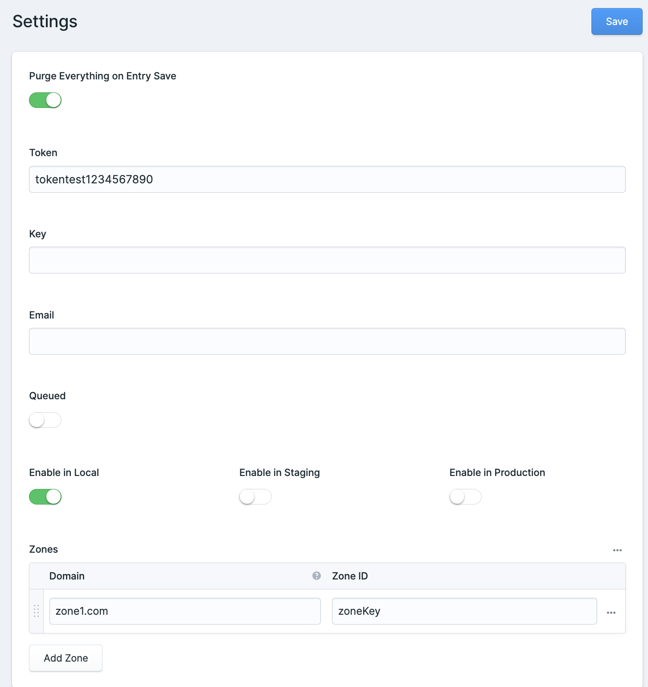
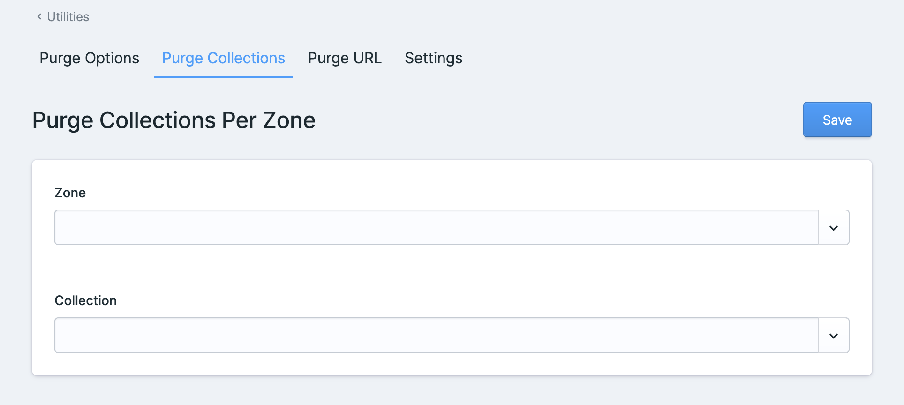
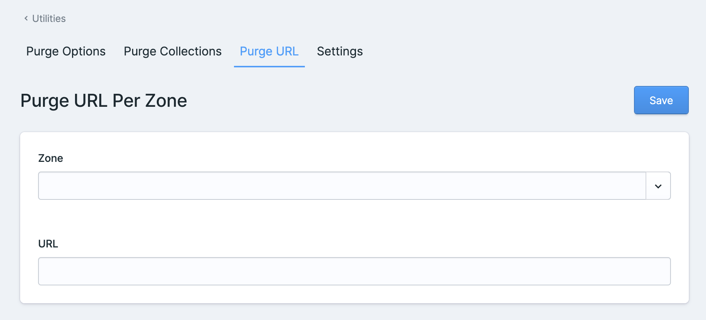
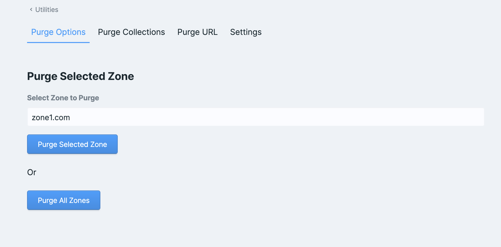

# Cloudflare Integration for Statamic

Cloudflare integration for Statamic with CLI, static caching integration, and control panel integration.

Inspired by [HandmadeWeb/statamic-cloudflare](https://github.com/HandmadeWeb/statamic-cloudflare)

## Requirements

* Statamic 5.0.0 or higher

## Installation

You can install the package via composer:

```shell
composer require brewdigital/statamic-cloudflare-addon
```

#### Copy the package config to your local config with the publish command:
The configuration file will not be published automatically to avoid overwrites. You can publish the configuration file using the following command:
```shell
php artisan vendor:publish --provider="BrewDigital\StatamicCloudflareAddon\ServiceProvider"
```

The configuration file can be modified from `/cp/utilities/cloudflare/settings`.

## Usage
Update Settings:

Purge collections per zone:

Purge url per zone:

Purge options:

### CLI

You can purge everything via the following command:

```shell
php artisan cloudflare:cache:purge:everything
```

### Static Caching

If you want to use `statamic-cloudflare` as a static cache strategy, then you will need to manually register the cacher in the register method of your `App\Providers\AppServiceProvider` class:

```php
/**
 * Register any application services.
 *
 * @return void
 */
public function register()
{
    \BrewDigital\StatamicCloudflareAddon\Cloudflare::registerCacher();
}
```

Then update your `static_cache` config:

```php
'strategies' => [

    'half' => [
        'driver' => 'application',
        'expiry' => null,
    ],

    'full' => [
        'driver' => 'file',
        'path' => public_path('static'),
        'lock_hold_length' => 0,
    ],

    'cloudflare' => [
        'driver' => 'cloudflare',
        'strategy' => 'null',
    ],
],
```

Then update the `static_cache` strategy at the top of the configuration to:

```php
'strategy' => 'cloudflare',
```

Currently, the Cloudflare integration is only used for purging. If you would like to use another caching strategy in combination with this caching strategy, then you are free to do that.

This can be done by updating the `strategy` section within the `cloudflare` strategy. Below is an example where we will be caching the application using the [half measure](https://statamic.dev/static-caching#application-driver):

```php
'cloudflare' => [
    'driver' => 'cloudflare',
    'strategy' => 'half',
],
```

In theory, you should be able to use any caching strategy here, such as the [full measure](https://statamic.dev/static-caching#file-driver) or any other first or third-party strategies. `statamic-cloudflare` will simply pass requests to the defined strategy and will just hook into the purge actions to also purge the page in Cloudflare.

### Control Panel

#### Events

`statamic-cloudflare` will listen to the `Statamic\Events\EntrySaved`, `Statamic\Events\EntryDeleted`, `Statamic\Events\TermSaved`, and `Statamic\Events\TermDeleted` events and will trigger a purge for the URL.
These events will be ignored if you have configured the `static cache` to be a strategy that uses the `cloudflare` driver, as the driver will instead handle the needed purging actions.

#### Utility

`statamic-cloudflare` will add a utility and a nav item to your Statamic CP.

Route: `/cp/utilities/cloudflare/settings`

This will be available to `Super Users` and the `Cloudflare Manager` and `Manage Brew Cloudflare Settings` are available to be assigned to any role.

You can purge everything quickly by navigating through the purging tabs.

By following these instructions and updating your `composer.json`, you ensure that the Cloudflare addon's configuration file is automatically published after installation or updates.